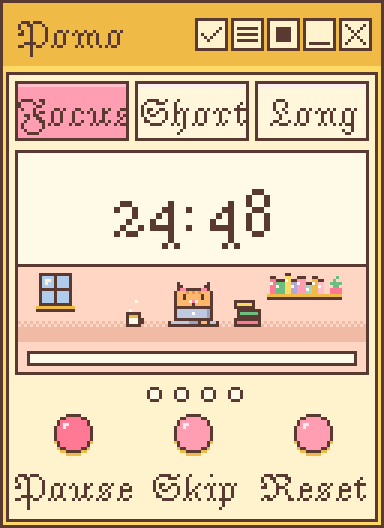

# Pixel Pomo
Pixel Pomo is a small pomodoro timer for your desktop!

## Download (Windows)

1. Go to the [latest release](../../releases/latest) and download **PixelPomo.exe**.
2. Double-click it.
3. If you see "Windows protected your PC", click **More info**, then **Run anyway**. (It's safe!)
4. To keep it handy, right-click the icon in the taskbar and choose **Pin to taskbar**!

## Mac

A Mac download is coming soon! (I don't have a Mac to build it on tho... (╥﹏╥) )If you don't want to wait, you can run it yourself:

1. Install Python from [python.org/downloads](https://www.python.org/downloads/).
2. On this page, click the green **Code** button, then **Download ZIP**, and unzip it.
3. Open the **Terminal**, type `cd ` (with a space after it), drag the unzipped folder into the Terminal window, and press **Return**.
4. Copy and paste this, then press **Return**:

       python3 -m pip install pygame-ce && python3 main.py

After the first time, you only need `python3 main.py` from step 4! I haven't tested it on a Mac yet, let me know if some things are wonky...

## How to use

- Press **Space** to start or pause the timer, or use the buttons on screen!
- Drag the top bar on the top left corner to move it anywhere.
- Use the buttons in the top bar for your **tasks**, **settings**, **pin to the top of your desktop**, and to **minimize** or **close**.
- Press **M** to switch mascots and **C** to change themes! These actions can also be done in settings.
- In settings, you can also customize your **time intervals** and **alarm sound**!

## Credits

Font: Jacquarda Bastarda 9, licensed under the SIL Open Font License.
